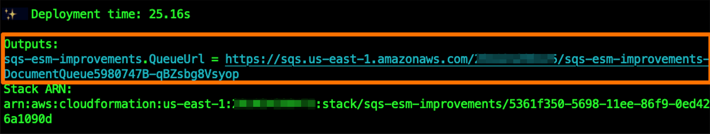
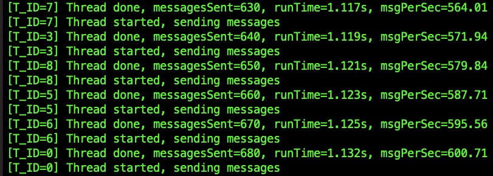
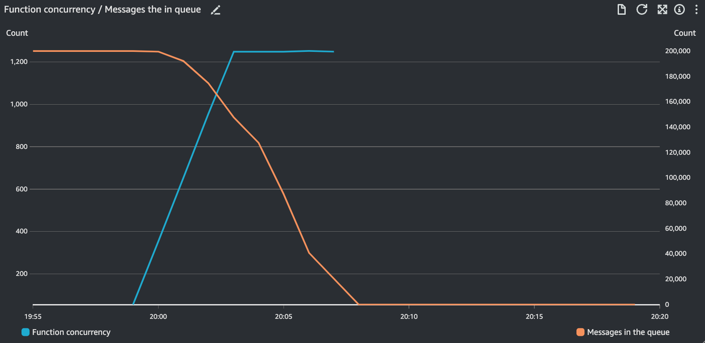

# AWS Lambda SQS Event-source Mapping Scaling Improvements Demo

This project is used to demonstrate the scaling improvements on the AWS Lambda SQS Event-source mapping. 

Read the full announcement blog [here](tbd). 

>  <br/> 
> This sample project is configured to demonstrate a large scale workload processing 200,000 messages. Running the project might incur charges to your account. 

## Pre-requisites

1. Install the AWS CLI and configure it with access permissions the region of your choice. Follow the instructions [here](https://aws.amazon.com/cli/).
   
2. Install the AWS CDK. Follow the instructions [here](https://docs.aws.amazon.com/cdk/v2/guide/getting_started.html).

3. Install Node.js. Follow the instructions [here](https://nodejs.org/en/download). 

## Installation

1. Clone this repository. Open the cloned directory

    ```bash
    git clone https://github.com/aws-samples/lambda-sqs-event-source-mapping-scaling-improvements.git

    cd lambda-sqs-event-source-mapping-scaling-improvements
    ```

2. Deploy the CDK Stack

    ```bash
    cdk deploy
    ```

    Take a note of the `sqs-esm-improvements.QueueUrl` output you'll receive after successful completion. 

    

3. Open the `/sqs-canon` directory. It contains a simple app that will populate your SQS queue with 200,000 messages. Update line 7 in `index.mjs` with the value of `sqs-esm-improvements.QueueUrl` you obtained in the previous step. 

4. Run the `sqs-cannon`. Confirm messages are being sent to the SQS queue. 

    ```bash
    node index.js
    ```

    

5. Navigate to CloudWatch Dashboards, and open a newly created dashboard that starts with `LambdaSqsEsmScalingDemoDashboard`. Watch the Lambda function graduallys scaling up as SQS queue is being drained. 

    

## Cleaning up
Use the `cdk destroy` command to delete the sample application stack

```bash
cdk destroy
```

## Additional resources

For more serverless learning resources, visit [Serverless Land](https://serverlessland.com/)

